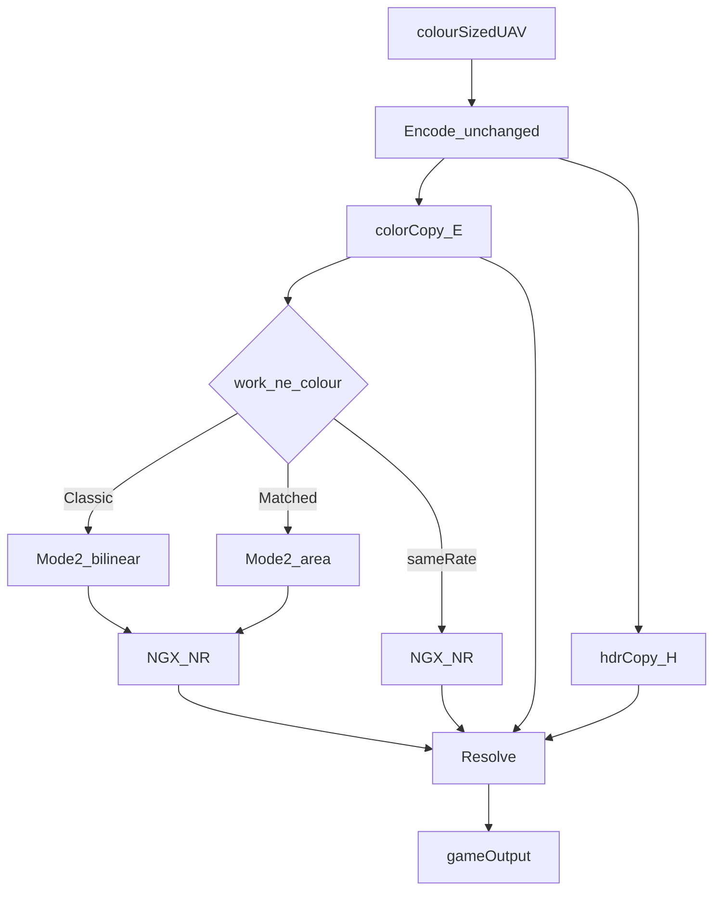

# Matched Residual Transfer Implementation Plan

> **For agentic workers:** REQUIRED SUB-SKILL: Use superpowers:subagent-driven-development (recommended) or superpowers:executing-plans to implement this plan task-by-task. Steps use checkbox (`- [ ]`) syntax for tracking.

**Goal:** Ship `DlssNrTransfer` as a user-facing Classic | Matched residual option that changes shrink + compose on the next `Dispatch`, leaving the live Classic picture as the default.

**Architecture:** One existing compute shader (`precompile/dlssnr.hlsl`), three modes. Encode is unchanged. Mode 2 branches on `gTransfer` (bilinear vs encoded area). Mode 1 Classic keeps today’s UpgradeToneMap(`H`, `U(p)`, `U(m)`); Matched builds `T = P + (U(m)-U(p))` (or `T = m` at same-rate), cube-scales `T` in HDR, then H0 or Inspect-only H1. `t3` is always `colorCopy` (`gProxy`). No new scratch.

**Tech Stack:** D3D12 compute (`cs_6_0`), OptiScaler Config/ImGui, NGX NR feature (untouched). Host fixture is a standalone `cl.exe` program — this repo has no gtest.

**Source of truth:** [OptiScaler/dlssnr/design/2026-09-02-matched-residual.md](OptiScaler/dlssnr/design/2026-09-02-matched-residual.md). Algorithm text there wins if a snippet here drifts.

**Save the working copy of this plan next to the spec** as [OptiScaler/dlssnr/design/2026-09-02-matched-residual-plan.md](OptiScaler/dlssnr/design/2026-09-02-matched-residual-plan.md) when implementation starts (Plan mode does not write it yet).

## Global Constraints

- Default `Transfer = Classic` (0). Fresh INI / missing key must match the live build at nonzero strength.
- `gTransfer` (this combo) and `gTransferStrength` (detail slider) are different fields. Do not overload one for the other.
- Do not rebuild the NR feature, swap the PSO, or allocate new scratch when Transfer changes.
- Set `gTransfer` on **downsample and resolve**. Zero-init downsample is a Classic bilinear bug.
- Do not change `DlssNrUseProxy` early return, NGX evaluate, guides, WorkingScale hold, or feature-create hold.
- Do not rewrite [OptiScaler/dlssnr/DlssNr_Codec.h](OptiScaler/dlssnr/DlssNr_Codec.h). Live shader is `precompile/dlssnr.hlsl`. Call `codec::TypedFormat` only.
- Do not invert K/SRTM, temporally accumulate model RGB, EASU/Lanczos model RGB, or downsample open linear then re-encode.
- Do not implement C1 affine / JBU / LUT / GLU. Do not add a work-res residual UAV.
- Strength 0 + `DebugView == 0` + `Compare == 0`: edited-side bytes equal `hdrCopy`. No `/W`, no lerp, no extra `max`. Not a claim on the upscaler UAV.
- Empty-model gate on `dot(m, kLuma) <= 1e-5`, never on `T`.
- `sameRate` from `gSource.GetDimensions()`, not `gGuideWidth` (that field is zero today).
- Area: float box, loop the overlapping range (no 5-tap cap), clamp-to-edge, divide by geometric `area`, centre-texel alpha, `Load` stored RGB (no decode).
- Numeric views in this slice. `CreateScratch` via `TypedFormat`. Compare rebuilds against the **remapped** format or `_SRGB` games park/recreate every frame.
- Commit only updated `dlssnr.hlsl` + `DlssNr_Shader.h` (`DlssNr_cso`). Do not add the bat’s Dx11 outputs or a new `.cso` (the tree only embeds the header).
- Do not mention “legacy”, “A/B only”, or “temporary” in the UI.
- T0–T7 / G default matrix: Placement = Post-process, `WorkAtNative` off, Output Scaling off, `DlssNrUseProxy` off, Compare off unless a row says otherwise. Multi-pass is **M only**.



---

### Task 1: Host-side area downsample (TA)

**Files:**
- Create: [OptiScaler/dlssnr/DlssNr_Area.h](OptiScaler/dlssnr/DlssNr_Area.h)
- Create: [OptiScaler/dlssnr/tests/area_fixture.cpp](OptiScaler/dlssnr/tests/area_fixture.cpp)
- Do **not** add either file to `OptiScaler.vcxproj` (standalone host program).

**Interfaces:**
- Consumes: spec §7.1 only
- Produces: `DlssNr::Overlap1D`, `DlssNr::AreaSample`, `DlssNr::AreaDownsamplePixel` — HLSL Mode 2 Matched must match these formulas

- [ ] **Step 1: Write the failing fixture** (header not present yet)

```cpp
// OptiScaler/dlssnr/tests/area_fixture.cpp
#include "../DlssNr_Area.h"

#include <cmath>
#include <cstdio>
#include <cstdlib>
#include <vector>

using DlssNr::AreaDownsamplePixel;
using DlssNr::AreaSample;

static int gFails = 0;

static void ExpectNear(const char* name, float got, float want, float eps = 1e-5f)
{
    if (std::fabs(got - want) > eps)
    {
        std::printf("FAIL %s: got %g want %g\n", name, got, want);
        ++gFails;
    }
}

static void TestOverlap1D()
{
    // dest pixel 0 of 3->2: box [0, 1.5). Texel 0 weight 1, texel 1 weight 0.5
    ExpectNear("ovl0", DlssNr::Overlap1D(0.f, 1.5f, 0), 1.f);
    ExpectNear("ovl1", DlssNr::Overlap1D(0.f, 1.5f, 1), 0.5f);
    ExpectNear("ovl2", DlssNr::Overlap1D(0.f, 1.5f, 2), 0.f);
}

static void Test2x2Mean()
{
    AreaSample src[4] = {
        { 1, 0, 0, 1 }, { 0, 1, 0, 1 },
        { 0, 0, 1, 1 }, { 1, 1, 1, 1 },
    };
    const auto p = AreaDownsamplePixel(src, 2, 2, 1, 1, 0, 0);
    ExpectNear("mean.r", p.r, 0.5f);
    ExpectNear("mean.g", p.g, 0.5f);
    ExpectNear("mean.b", p.b, 0.5f);
}

static void TestCopy()
{
    AreaSample src[1] = { { 0.25f, 0.5f, 0.75f, 0.125f } };
    const auto p = AreaDownsamplePixel(src, 1, 1, 1, 1, 0, 0);
    ExpectNear("copy.r", p.r, 0.25f);
    ExpectNear("copy.a", p.a, 0.125f);
}

static void Test3to2NotUintTruncated()
{
    // src 3, dst 2, x=1: float box [1.5, 3). uint box would be [1, 3) and overweight texel 1.
    AreaSample src[3] = { { 1, 0, 0, 1 }, { 0, 1, 0, 1 }, { 0, 0, 1, 1 } };
    const auto p = AreaDownsamplePixel(src, 3, 1, 2, 1, 1, 0);
    const float area = 1.5f;
    ExpectNear("3to2.r", p.r, 0.f);
    ExpectNear("3to2.g", p.g, 0.5f / area);
    ExpectNear("3to2.b", p.b, 1.f / area);
}

int main()
{
    TestOverlap1D();
    Test2x2Mean();
    TestCopy();
    Test3to2NotUintTruncated();
    if (gFails)
    {
        std::printf("%d FAIL\n", gFails);
        return 1;
    }
    std::printf("TA PASS\n");
    return 0;
}
```

- [ ] **Step 2: Compile; expect FAIL** (missing header)

```bat
cd /d C:\Workspace\OptiScaler_DLSSNR-pr-multipass
cl /nologo /EHsc /std:c++17 /W4 OptiScaler\dlssnr\tests\area_fixture.cpp /Fe:OptiScaler\dlssnr\tests\area_fixture.exe
```

Expected: `fatal error C1083: Cannot open include file: '../DlssNr_Area.h'`

- [ ] **Step 3: Write the header**

```cpp
// OptiScaler/dlssnr/DlssNr_Area.h
#pragma once

#include <algorithm>
#include <cmath>

namespace DlssNr
{

inline float Overlap1D(float box0, float box1, int i)
{
    const float t0 = (float) i;
    const float t1 = (float) (i + 1);
    const float a = box0 > t0 ? box0 : t0;
    const float b = box1 < t1 ? box1 : t1;
    return b > a ? (b - a) : 0.0f;
}

struct AreaSample
{
    float r, g, b, a;
};

// src is row-major srcW*srcH. Matches spec §7.1 / HLSL Mode 2 Matched.
inline AreaSample AreaDownsamplePixel(const AreaSample* src, int srcW, int srcH, int dstW, int dstH,
                                      int x, int y)
{
    if (dstW == srcW && dstH == srcH)
        return src[y * srcW + x];

    const float x0 = ((float) x * (float) srcW) / (float) dstW;
    const float x1 = ((float) (x + 1) * (float) srcW) / (float) dstW;
    const float y0 = ((float) y * (float) srcH) / (float) dstH;
    const float y1 = ((float) (y + 1) * (float) srcH) / (float) dstH;
    const float area = (x1 - x0) * (y1 - y0);

    const int i0 = (int) floorf(x0);
    const int i1 = (int) ceilf(x1) - 1;
    const int j0 = (int) floorf(y0);
    const int j1 = (int) ceilf(y1) - 1;

    float ar = 0.f, ag = 0.f, ab = 0.f;
    for (int j = j0; j <= j1; ++j)
    {
        const int jj = std::clamp(j, 0, srcH - 1);
        const float wy = Overlap1D(y0, y1, j);
        for (int i = i0; i <= i1; ++i)
        {
            const int ii = std::clamp(i, 0, srcW - 1);
            const float w = Overlap1D(x0, x1, i) * wy;
            const AreaSample& s = src[jj * srcW + ii];
            ar += s.r * w;
            ag += s.g * w;
            ab += s.b * w;
        }
    }

    const float cx = ((float) x + 0.5f) * (float) srcW / (float) dstW;
    const float cy = ((float) y + 0.5f) * (float) srcH / (float) dstH;
    const int acx = std::clamp((int) floorf(cx), 0, srcW - 1);
    const int acy = std::clamp((int) floorf(cy), 0, srcH - 1);

    return { ar / area, ag / area, ab / area, src[acy * srcW + acx].a };
}

} // namespace DlssNr
```

- [ ] **Step 4: Recompile and run**

```bat
cl /nologo /EHsc /std:c++17 /W4 OptiScaler\dlssnr\tests\area_fixture.cpp /Fe:OptiScaler\dlssnr\tests\area_fixture.exe
OptiScaler\dlssnr\tests\area_fixture.exe
```

Expected: `TA PASS`

- [ ] **Step 5: Commit** `feat(dlssnr): host fixture for matched-residual area downsample`

---

### Task 2: Enums, Config, constant buffer

**Files:**
- Modify: [OptiScaler/dlssnr/DlssNr_Modes.h](OptiScaler/dlssnr/DlssNr_Modes.h)
- Modify: [OptiScaler/dlssnr/DlssNr_Modes.cpp](OptiScaler/dlssnr/DlssNr_Modes.cpp)
- Modify: [OptiScaler/shaders/dlssnr/DlssNr_Common.h](OptiScaler/shaders/dlssnr/DlssNr_Common.h)
- Modify: [OptiScaler/Config.h](OptiScaler/Config.h) (DlssNr block ~259–316)
- Modify: [OptiScaler/Config.cpp](OptiScaler/Config.cpp) (read ~318–348, write ~1177–1212)
- Modify: [OptiScaler/dlssnr/tests/area_fixture.cpp](OptiScaler/dlssnr/tests/area_fixture.cpp) — add clamp tests

**Interfaces:**
- Consumes: `ConfiguredMode()` clamp pattern in `DlssNr_Modes.cpp`
- Produces:
  - `enum class Transfer : uint32_t { Classic = 0, MatchedResidual = 1 };`
  - `inline Transfer ClampTransfer(uint32_t raw);`
  - `inline uint32_t ClampHdrLift(uint32_t raw);` — unknown → `0`
  - `Transfer ConfiguredTransfer();`
  - `uint32_t ConfiguredHdrLift();`
  - `DlssNrConstants::Transfer`, `::HdrLift` at offsets 68 and 72
  - `Config::DlssNrTransfer { 0 }`, `Config::DlssNrHdrLift { 0 }`
  - INI `[DlssNr] Transfer=0|1`, `HdrLift=0|1`

- [ ] **Step 1: Add clamp tests to the fixture** (will fail until Modes.h grows)

```cpp
#include "../DlssNr_Modes.h"

static void TestClamps()
{
    if (DlssNr::ClampTransfer(0) != DlssNr::Transfer::Classic) { std::printf("FAIL t0\n"); ++gFails; }
    if (DlssNr::ClampTransfer(1) != DlssNr::Transfer::MatchedResidual) { std::printf("FAIL t1\n"); ++gFails; }
    if (DlssNr::ClampTransfer(2) != DlssNr::Transfer::Classic) { std::printf("FAIL t2\n"); ++gFails; }
    if (DlssNr::ClampHdrLift(0) != 0) { std::printf("FAIL h0\n"); ++gFails; }
    if (DlssNr::ClampHdrLift(1) != 1) { std::printf("FAIL h1\n"); ++gFails; }
    if (DlssNr::ClampHdrLift(9) != 0) { std::printf("FAIL h9\n"); ++gFails; }
}
```

Call `TestClamps()` from `main`. Rebuild: expect compile FAIL (`ClampTransfer` not found).

- [ ] **Step 2: Add enum + inlines to `DlssNr_Modes.h`** immediately after `enum class Mode`

```cpp
enum class Transfer : uint32_t
{
    Classic = 0,
    MatchedResidual = 1,
};

inline Transfer ClampTransfer(uint32_t raw)
{
    return raw > (uint32_t) Transfer::MatchedResidual ? Transfer::Classic : (Transfer) raw;
}

inline uint32_t ClampHdrLift(uint32_t raw) { return raw > 1u ? 0u : raw; }

Transfer ConfiguredTransfer();
uint32_t ConfiguredHdrLift();
```

- [ ] **Step 3: Implement readers in `DlssNr_Modes.cpp`** next to `ConfiguredMode()`

```cpp
Transfer ConfiguredTransfer()
{
    return ClampTransfer(Config::Instance()->DlssNrTransfer.value_or_default());
}

uint32_t ConfiguredHdrLift()
{
    return ClampHdrLift(Config::Instance()->DlssNrHdrLift.value_or_default());
}
```

- [ ] **Step 4: Config keys**

In `Config.h`, after `DlssNrWorkAtNative`:

```cpp
// 0 Classic (live path), 1 Matched residual. How a below-frame model is brought back.
CustomOptional<uint32_t> DlssNrTransfer { 0 };
// 0 UpgradeToneMap (H0), 1 additive headroom (H1). Used only if Transfer == 1.
CustomOptional<uint32_t> DlssNrHdrLift { 0 };
```

Change the `DlssNrDebugView` comment from `0 off, 1 … 3 …` to `0–5` (views 4–5 are full-res proxy / T).

In `Config.cpp` read (with the other `DlssNr*` keys):

```cpp
DlssNrTransfer.set_from_config(readUInt("DlssNr", "Transfer"));
DlssNrHdrLift.set_from_config(readUInt("DlssNr", "HdrLift"));
```

In `Config.cpp` write:

```cpp
ini.SetValue("DlssNr", "Transfer", GetIntValue(Instance()->DlssNrTransfer.value_for_config()).c_str());
ini.SetValue("DlssNr", "HdrLift", GetIntValue(Instance()->DlssNrHdrLift.value_for_config()).c_str());
```

- [ ] **Step 5: Constant buffer** — append after `CompareSwap` in `DlssNrConstants` ([DlssNr_Common.h](OptiScaler/shaders/dlssnr/DlssNr_Common.h) ~106). Do not touch `MvScale*` or `GuideWidth`/`GuideHeight`.

```cpp
    uint32_t Transfer; // 0 Classic, 1 Matched residual
    uint32_t HdrLift;  // 0 H0, 1 H1; ignored unless Transfer == 1
};

#include <cstddef>

static_assert(offsetof(DlssNrConstants, Transfer) == 68, "HLSL gTransfer must sit at 68");
static_assert(offsetof(DlssNrConstants, HdrLift) == 72, "HLSL gHdrLift must sit at 72");
static_assert(sizeof(DlssNrConstants) == 256, "CBV size is 256-aligned");
```

If the compiler inserts padding, add explicit `uint32_t _pad0` **before** `Transfer` so those offsets hold, then re-check. HLSL field order in Task 5 must match.

- [ ] **Step 6: Rebuild fixture + OptiScaler**

```bat
cl /nologo /EHsc /std:c++17 /W4 OptiScaler\dlssnr\tests\area_fixture.cpp /Fe:OptiScaler\dlssnr\tests\area_fixture.exe
OptiScaler\dlssnr\tests\area_fixture.exe
```

Expected: `TA PASS`. Then build OptiScaler (Release or current config). Expected: compile OK. Behavior still Classic — new uints are zero-init until Task 4 writes them.

- [ ] **Step 7: Commit** `feat(dlssnr): add Transfer and HdrLift config plus cbuffer fields`

---

### Task 3: Numeric scratch views

**Files:**
- Modify: [OptiScaler/shaders/dlssnr/DlssNr_Dx12.cpp](OptiScaler/shaders/dlssnr/DlssNr_Dx12.cpp) `CreateScratch` (~519), `ReleaseSurfacesIfFormatChanged` (~502), `DispatchPass` SRV loop (~845)

**Interfaces:**
- Consumes: `codec::TypedFormat` in [DlssNr_Codec.h](OptiScaler/dlssnr/DlssNr_Codec.h) (already included; maps `*_UNORM_SRGB` → `*_UNORM`)
- Produces: `colorCopy` / `colorSmall` / `g_nr.output` / `hdrCopy` created numeric; SRVs in this pass never stay `_SRGB`

**Landmine:** `ReleaseSurfacesIfFormatChanged(desc.Format)` compares the game colour format to `g_nr.output->GetDesc().Format`. After remapping, those differ on every passthrough SDR frame and the feature is parked forever. Compare the remapped format.

- [ ] **Step 1: Remap in `CreateScratch`**

```cpp
ID3D12Resource* CreateScratch(ID3D12Device* device, DXGI_FORMAT format, unsigned int width,
                              unsigned int height)
{
    format = codec::TypedFormat(format);
    // ... existing desc / CreateCommittedResource, using `format`
}
```

- [ ] **Step 2: Remap the rebuild compare**

```cpp
void ReleaseSurfacesIfFormatChanged(DXGI_FORMAT needed)
{
    needed = codec::TypedFormat(needed);
    if (g_nr.output == nullptr || g_nr.output->GetDesc().Format == needed)
        return;
    // ... existing park
}
```

- [ ] **Step 3: Numeric SRV override** — `CreateShaderResourceView` already takes `DXGI_FORMAT format = DXGI_FORMAT_UNKNOWN` ([Shader_Dx12.h](OptiScaler/shaders/Shader_Dx12.h)). `TranslateTypelessFormats` does **not** strip `_SRGB`.

In `DispatchPass`:

```cpp
for (uint32_t i = 0; i < kSrvCount; ++i)
{
    CreateShaderResourceView(_device, srvs[i], currentHeap.GetSrvCPU(i),
                             codec::TypedFormat(srvs[i]->GetDesc().Format));
}
```

Do not change `CreateUnorderedAccessView` in the base class. Scratch UAVs inherit the remapped resource format. The game output UAV stays the game’s format.

- [ ] **Step 4: Build OptiScaler.** HDR (`R16G16B16A16_FLOAT`) is a no-op remap. No log spam of `rebuilding surfaces: format`.

- [ ] **Step 5: Commit** `fix(dlssnr): create scratch and SRVs as numeric formats`

---

### Task 4: Bind `gProxy` and upload Transfer

**Files:**
- Modify: [OptiScaler/shaders/dlssnr/DlssNr_Dx12.h](OptiScaler/shaders/dlssnr/DlssNr_Dx12.h) `DispatchPass` (~76–79)
- Modify: [OptiScaler/shaders/dlssnr/DlssNr_Dx12.cpp](OptiScaler/shaders/dlssnr/DlssNr_Dx12.cpp) `DispatchPass` + downsample constants (~1202) + resolve constants/call (~1313)

**Interfaces:**
- Consumes: `ConfiguredTransfer()`, `ConfiguredHdrLift()`, `g_nr.colorCopy`
- Produces: slot 3 is `colorCopy` on resolve for **both** Transfer values; downsample constants carry `Transfer`

- [ ] **Step 1: Rename the 4th input** `InMotion` → `InProxy` in the header and the `.cpp` definition. Stand-in stays `InSource` when null. `kSrvCount` stays 5.

- [ ] **Step 2: Downsample constants** (required)

```cpp
DlssNrConstants down {};
down.Mode = DlssNrMode_Downsample;
down.Width = workWidth;
down.Height = workHeight;
down.Transfer = (uint32_t) DlssNr::ConfiguredTransfer();
DispatchPass(cmdList, down, modelInput, nullptr, nullptr, nullptr, nullptr,
             g_nr.colorSmall, nullptr);
```

- [ ] **Step 3: Resolve constants + bind**

```cpp
resolveParams.Transfer = (uint32_t) DlssNr::ConfiguredTransfer();
resolveParams.HdrLift = DlssNr::ConfiguredHdrLift();
// existing fields unchanged
DispatchPass(cmdList, resolveParams, modelInput, g_nr.output, g_nr.hdrCopy, g_nr.colorCopy,
             nullptr, target, nullptr);
```

Encode still passes `nullptr` for `InProxy`. `motionIn` remains NGX-only (`ReadableGuide` / `evaluate`). Do not bind it to the compose shader.

Do **not** change the `DlssNrUseProxy` block that returns before resolve.

- [ ] **Step 4: Build.** With the current CSO, extra constants are ignored and slot 3 is unread. Picture must match today’s Classic.

- [ ] **Step 5: Commit** `feat(dlssnr): bind colorCopy as gProxy and upload Transfer`

---

### Task 5: Shader (Mode 2 + Mode 1) and CSO

**Files:**
- Modify: [OptiScaler/shaders/dlssnr/precompile/dlssnr.hlsl](OptiScaler/shaders/dlssnr/precompile/dlssnr.hlsl)
- Modify: [OptiScaler/shaders/dlssnr/precompile/DlssNr_Shader.h](OptiScaler/shaders/dlssnr/precompile/DlssNr_Shader.h) via rebuild
- Do not commit `dlssnr_Shader_Dx11.cso` / `*_Dx11.h` / a new `.cso` if the bat writes them

**Interfaces:**
- Consumes: cbuffer layout from Task 2; `DlssNr_Area.h` formulas; spec §8 and §11
- Produces: live CSO matching the new HLSL (`DlssNr_cso`)

- [ ] **Step 1: Extend the cbuffer** after `gCompareSwap` — order must match C++ offsets 68/72

```hlsl
    uint  gCompareSwap;
    uint  gTransfer;   // 0 Classic, 1 Matched residual
    uint  gHdrLift;    // 0 H0, 1 H1; ignored unless gTransfer == 1
};
```

- [ ] **Step 2: Rename the slot**

```hlsl
Texture2D<float4>   gProxy    : register(t3);  // resolve: colorCopy (full-res encoded proxy)
```

Leave unused `EditAt` as-is (it only reads `gSource`/`gModel`).

- [ ] **Step 3: Replace Mode 2** (today: one `SampleLevel`). Classic line is bit-for-bit the live one.

```hlsl
    if (gMode == 2)
    {
        if (gTransfer == 0)
        {
            gTarget[id.xy] = gSource.SampleLevel(gLinear, uv, 0);
            return;
        }

        uint srcW, srcH;
        gSource.GetDimensions(srcW, srcH);
        if (srcW == gWidth && srcH == gHeight)
        {
            gTarget[id.xy] = gSource.Load(int3(id.xy, 0));
            return;
        }

        const float x0 = ((float) id.x * (float) srcW) / (float) gWidth;
        const float x1 = ((float) (id.x + 1) * (float) srcW) / (float) gWidth;
        const float y0 = ((float) id.y * (float) srcH) / (float) gHeight;
        const float y1 = ((float) (id.y + 1) * (float) srcH) / (float) gHeight;
        const float area = (x1 - x0) * (y1 - y0);

        const int i0 = (int) floor(x0);
        const int i1 = (int) ceil(x1) - 1;
        const int j0 = (int) floor(y0);
        const int j1 = (int) ceil(y1) - 1;

        float3 acc = 0.0;
        for (int j = j0; j <= j1; ++j)
        {
            const int jj = clamp(j, 0, (int) srcH - 1);
            const float t0y = (float) j;
            const float aY = max(y0, t0y);
            const float bY = min(y1, t0y + 1.0);
            const float wy = max(bY - aY, 0.0);
            for (int i = i0; i <= i1; ++i)
            {
                const int ii = clamp(i, 0, (int) srcW - 1);
                const float t0x = (float) i;
                const float aX = max(x0, t0x);
                const float bX = min(x1, t0x + 1.0);
                const float w = max(bX - aX, 0.0) * wy;
                acc += gSource.Load(int3(ii, jj, 0)).rgb * w;
            }
        }

        const int acx = clamp((int) floor(((float) id.x + 0.5) * (float) srcW / (float) gWidth), 0, (int) srcW - 1);
        const int acy = clamp((int) floor(((float) id.y + 0.5) * (float) srcH / (float) gHeight), 0, (int) srcH - 1);
        const float a = gSource.Load(int3(acx, acy, 0)).a;
        gTarget[id.xy] = float4(acc / area, a);
        return;
    }
```

No `[unroll]`, no 5-tap cap, no weight renormalise.

- [ ] **Step 4: Mode 1 helpers** (after `SrgbToLinear`)

```hlsl
float3 DecodeRgb(float3 rgb)
{
    return gPassthrough != 0 ? rgb : SrgbToLinear(rgb);
}

float3 CubeScaleResidual(float3 P, float3 T)
{
    if (gPassthrough != 0)
        return T;
    float3 d = T - P;
    float alpha = 1.0;
    [unroll] for (int c = 0; c < 3; ++c)
    {
        if (d[c] > 1e-6)
            alpha = min(alpha, (1.0 - P[c]) / d[c]);
        else if (d[c] < -1e-6)
            alpha = min(alpha, (0.0 - P[c]) / d[c]);
    }
    return P + saturate(alpha) * d;
}

// Live UpgradeToneMap body, parameterized. Empty-model gate is the caller's job.
float3 ComposeUpgrade(float3 H, float3 proxyRgb, float3 modelRgb)
{
    float originalLuma = dot(H, kLuma);
    float proxyLuma = dot(proxyRgb, kLuma);
    float modelLuma = dot(modelRgb, kLuma);
    float ratio;
    if (originalLuma < proxyLuma)
        ratio = originalLuma / max(proxyLuma, 1e-6);
    else
        ratio = (modelLuma + max(0.0, originalLuma - proxyLuma)) / modelLuma;
    float3 upgraded = lerp(H, HueOkLab(modelRgb * ratio, modelRgb), gTransferStrength);
    float upgradedLuma = dot(upgraded, kLuma);
    const float kRatioFloor = 1.0 / 512.0;
    float lumaRatio = clamp((upgradedLuma + kRatioFloor) / (originalLuma + kRatioFloor), 0.0, gMaxRatio);
    return lerp(H * lumaRatio, upgraded, gColourStrength);
}
```

- [ ] **Step 5: Replace resolve control flow** after `cmpUv` / `showOriginal` / `onDivider` / `outsideFrame` are known. Follow spec §11 exactly.

```hlsl
    float3 p = DecodeRgb(gSource.SampleLevel(gLinear, cmpUv, 0).rgb);
    float3 m = DecodeRgb(gModel.SampleLevel(gLinear, cmpUv, 0).rgb);
    float4 originalSample = gCompareMode == 1 ? gOriginal.SampleLevel(gLinear, cmpUv, 0)
                                              : gOriginal.Load(int3(id.xy, 0));
    const float normScale = gPassthrough != 0 ? 1.0 : max(gWhitePoint, 1e-4);
    float3 H = originalSample.rgb / normScale;

    if (gDebugView == 1)
    {
        gTarget[id.xy] = float4(p * gWhitePoint, originalSample.a);
        return;
    }
    if (gDebugView == 2)
    {
        gTarget[id.xy] = float4(m * gWhitePoint, originalSample.a);
        return;
    }
    if (gDebugView == 3)
    {
        float3 shown = saturate(0.5 + (m - p) * 20.0);
        gTarget[id.xy] = float4(SrgbToLinear(shown) * gWhitePoint, originalSample.a);
        return;
    }

    if (gDebugView == 4 || gDebugView == 5)
    {
        float3 shown = 0.0;
        if (gTransfer == 1)
        {
            float4 eSample = gCompareMode == 1 ? gProxy.SampleLevel(gLinear, cmpUv, 0)
                                               : gProxy.Load(int3(id.xy, 0));
            float3 P = DecodeRgb(eSample.rgb);
            uint srcW, srcH;
            gSource.GetDimensions(srcW, srcH);
            bool sameRate = (srcW == gWidth && srcH == gHeight);
            float3 T = sameRate ? m : CubeScaleResidual(P, P + (m - p));
            shown = (gDebugView == 4 ? P : T) * gWhitePoint;
        }
        gTarget[id.xy] = float4(shown, originalSample.a);
        return;
    }

    if (gTransferStrength == 0)
    {
        float4 o = gCompareMode == 1 ? gOriginal.SampleLevel(gLinear, cmpUv, 0)
                                     : gOriginal.Load(int3(id.xy, 0));
        float3 rgb = o.rgb;
        if (outsideFrame)
            rgb = 0.0;
        if (onDivider)
            rgb = gWhitePoint;
        gTarget[id.xy] = float4(rgb, o.a);
        return;
    }

    float3 result;
    if (gTransfer == 0)
    {
        if (dot(m, kLuma) <= 1e-5)
            result = H * normScale;
        else
            result = ComposeUpgrade(H, p, m) * normScale;
    }
    else
    {
        float4 eSample = gCompareMode == 1 ? gProxy.SampleLevel(gLinear, cmpUv, 0)
                                           : gProxy.Load(int3(id.xy, 0));
        float3 P = DecodeRgb(eSample.rgb);
        uint srcW, srcH;
        gSource.GetDimensions(srcW, srcH);
        bool sameRate = (srcW == gWidth && srcH == gHeight);
        float3 T = sameRate ? m : CubeScaleResidual(P, P + (m - p));

        if (dot(m, kLuma) <= 1e-5)
            result = H * normScale;
        else if (gHdrLift == 1)
            result = lerp(H, H + (T - P), gTransferStrength) * normScale;
        else
            result = ComposeUpgrade(H, P, T) * normScale;
    }

    if (showOriginal)
        result = originalSample.rgb;
    if (outsideFrame)
        result = 0.0;
    if (onDivider)
        result = gWhitePoint;
    gTarget[id.xy] = float4(max(result, 0.0), originalSample.a);
```

Encode (`gMode == 0`) stays the current function body.

Wipe (`CompareMode == 2`) Loads `P` via the `gCompareMode == 1 ? Sample : Load` already in the snippet. Side-by-side samples `P` at `cmpUv`.

- [ ] **Step 6: Rebuild CSO** from `OptiScaler/shaders/dlssnr/precompile`. The stock bat writes `dlssnr_Shader.h` / `dlssnr_cso` and Dx11 artifacts; the live include is `DlssNr_Shader.h` / `DlssNr_cso`. Drive the header directly:

```bat
cd /d C:\Workspace\OptiScaler_DLSSNR-pr-multipass\OptiScaler\shaders\dlssnr\precompile
..\shader_tools\dxc.exe -T cs_6_0 -E CSMain -O3 -Qstrip_debug -Qstrip_reflect dlssnr.hlsl -Fo dlssnr_Shader.cso
python ..\shader_tools\create_header.py dlssnr_Shader.cso DlssNr_Shader.h DlssNr_cso
del /q dlssnr_Shader.cso 2>nul
del /q dlssnr_Shader_Dx11.cso DlssNr_Shader_Dx11.h dlssnr_Shader_Dx11.h 2>nul
```

Constructor uses `source = nullptr`; a stale header is a silent old shader.

- [ ] **Step 7: Build OptiScaler and smoke Classic** (T4 / T0): Transfer unset or 0, WorkingScale 0.67, nonzero strength — picture matches the live build. Strength 0 + Compare off + Debug off — output matches `hdrCopy` (T1; do not use Capture “before”, that is `colorCopy`).

- [ ] **Step 8: T7 (implementer-only, revert)** — temporarily bind `gSource = gModel` on resolve (`DispatchPass(..., g_nr.output, g_nr.output, ...)`). Debug 5 must equal debug 4 (`m=p ⇒ T=P`). Revert the bind before commit.

- [ ] **Step 9: Commit** `feat(dlssnr): matched-residual downsample and resolve` (hlsl + `DlssNr_Shader.h` only)

---

### Task 6: Menu, README, in-game matrix

**Files:**
- Modify: [OptiScaler/dlssnr/DlssNr_Menu.cpp](OptiScaler/dlssnr/DlssNr_Menu.cpp)
- Modify: [OptiScaler/dlssnr/README.md](OptiScaler/dlssnr/README.md)

**Interfaces:**
- Consumes: `DlssNrTransfer`, `DlssNrHdrLift`, `ConfiguredTransfer()`
- Produces: Cost combo under the model-resolution slider; Inspect HDR lift; six debug names always

- [ ] **Step 1: Cost combo** — after the Model resolution `HelpMarker` (~226), still under `SeparatorText("Cost")`, before `"How much of it lands"`:

```cpp
{
    static const char* transferNames[] = { "Classic", "Matched residual" };
    int transfer = (int) config->DlssNrTransfer.value_or_default();
    if (transfer < 0 || transfer > (int) DlssNr::Transfer::MatchedResidual)
        transfer = (int) DlssNr::Transfer::Classic;
    if (ImGui::Combo("Transfer", &transfer, transferNames, IM_ARRAYSIZE(transferNames)))
        config->DlssNrTransfer = (uint32_t) transfer;

    HelpMarker("How a below-frame model is brought back onto the picture this pass writes."
               "\n\nClassic is the current path: shrink with bilinear, then fold the small answer"
               "\ndirectly onto the full-resolution picture. It is the default."
               "\n\nMatched residual keeps a sharp copy of the picture the model was shown, adds only"
               "\nwhat the model changed, and then runs the same highlight-aware compose. The shrink"
               "\nis an area filter so the model is not fed an aliased thumbnail."
               "\n\nWhen the model is the same size as this frame the two match. Changing this does"
               "\nnot rebuild the model; the next frame uses the new shrink and the new compose.");
}
```

Keep the combo **enabled** at 100% Cost.

- [ ] **Step 2: Detail-strength help** — replace “0 gives back exactly what the upscaler produced” with identity = `hdrCopy` (the encode keep), not the upscaler UAV.

- [ ] **Step 3: Inspect** — HDR lift enabled only when Transfer is Matched; debug combo always six names:

```cpp
const bool matched = DlssNr::ConfiguredTransfer() == DlssNr::Transfer::MatchedResidual;
ImGui::BeginDisabled(!matched);
{
    static const char* liftNames[] = { "UpgradeToneMap", "Additive headroom" };
    int lift = (int) config->DlssNrHdrLift.value_or_default();
    if (lift < 0 || lift > 1)
        lift = 0;
    if (ImGui::Combo("HDR lift", &lift, liftNames, IM_ARRAYSIZE(liftNames)))
        config->DlssNrHdrLift = (uint32_t) lift;
    HelpMarker("Matched residual only. UpgradeToneMap is the default highlight-aware compose."
               "\n\nAdditive headroom adds the model's change onto the original. Detail strength"
               "\nstill lerps toward that sum; Colour strength does not apply.");
}
ImGui::EndDisabled();

static const char* debugNames[] = {
    "Off",
    "Proxy (what the model sees)",
    "Model output (raw)",
    "Difference (amplified)",
    "Full-res proxy",
    "Matched T",
};
```

Do not shrink the debug combo on Classic (a stored `DebugView == 4` would then sit past the last item). Views 4–5 write black on Classic (shader). No “legacy” / “A/B” / “temporary” copy.

- [ ] **Step 4: README** — in [OptiScaler/dlssnr/README.md](OptiScaler/dlssnr/README.md) “Design notes”:
  - Two transfers; Classic is the default live path; Matched residual is area shrink + residual onto `colorCopy` then the same UpgradeToneMap (or Inspect H1).
  - Replace “composition is not a delta” as the only story: Classic is still ratio compose; Matched transfers a residual onto `P` first.
  - Replace “At strength zero the frame is bit-identical, always” (upscaler UAV) with: strength 0 writes `hdrCopy`. Capture “before” is `colorCopy` and is not that identity.

- [ ] **Step 5: In-game matrix** (freeze model version and scene; do not move Transfer / Colour / WhitePoint in the same take as T2)

  - **TA:** `area_fixture.exe` still prints `TA PASS`
  - **T0:** fresh config, Transfer unset — default strengths match the live build
  - **T1:** `TransferStrength = 0`, either option, Compare 0, Debug 0 — bytes match `hdrCopy`
  - **T2:** toggle Classic ↔ Matched at WorkingScale 0.67 — picture changes, no hitch; log must **not** show `ParkNrFeature` / `resolutionChanged` / a feature rebuild
  - **T3:** toggle at WorkingScale 1.0 — no visible difference; INI still records the choice; combo stays enabled
  - **T4:** Classic @ 0.67 — matches live bilinear + cross-rate compose (nonzero strength)
  - **T5:** Matched vs Classic @ 0.67 — less edge halo, original detail kept; Debug-1 may differ (area vs bilinear)
  - **T6:** Matched H0 vs H1 — H1 does not amplify highlight boil; Detail strength moves H1; Colour strength does not; default H0
  - **P:** 8-bit / non-float game — no double encode; no per-frame scratch rebuild
  - **M:** Multi-pass + either Transfer — Feature 1 1:1; FSR1 after `Run`; no double NR (not the T2/T5 scale)
  - **G:** timestamps — Matched extra vs Classic ≪ one DLSS SR

- [ ] **Step 6: Commit** `feat(dlssnr): expose Transfer and HDR lift in the NR menu`

---

## Self-review (spec coverage)

- §2 product / INI / enum / same-rate / runtime / H1 → Tasks 2, 4, 5, 6
- §3 non-goals → Global Constraints
- §4 contracts (strength 0, alpha, passthrough, empty model, identities) → Tasks 5, 6
- §6 bindings + numeric views + downsample `Transfer` → Tasks 3, 4
- §7 area algorithm → Tasks 1, 5
- §8 resolve / cube-scale / H0 / H1 / debug → Task 5
- §9 menu copy → Task 6
- §10 / §13 file list + CSO names → Tasks 2–6 (`DlssNr_cso`, no Dx11)
- §14 / §15 tests + acceptance → Tasks 1, 5, 6
- Open items (§17): offset asserts in Task 2; debug 4/5 SBS samples `P` at `cmpUv` in Task 5

No C1 affine, no residual UAV, no `GuideWidth` overload, no `LegacyResolve`.
